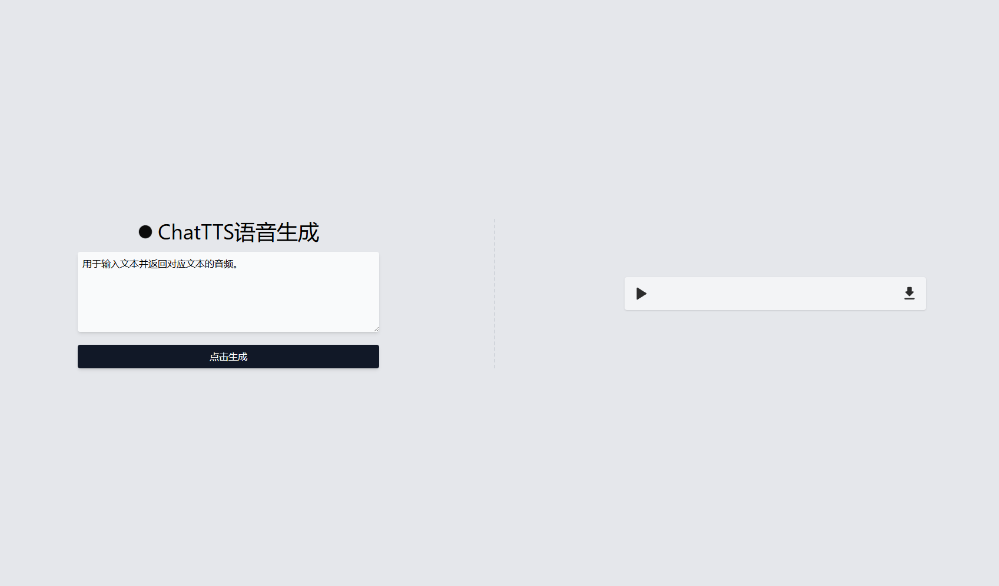

# ChatTTS语音生成



这是一个基于 Vite + Vue 3 + TypeScript 的单页面应用，用于输入文本并返回对应文本的音频。项目使用 TailwindCSS 作为样式框架，提供简洁的用户界面和流畅的用户体验。

## 目录

- [ChatTTS语音生成](#chattts语音生成)
  - [目录](#目录)
  - [安装与运行](#安装与运行)
  - [功能介绍](#功能介绍)
  - [项目结构](#项目结构)
  - [技术栈](#技术栈)
  - [贡献](#贡献)
  - [许可证](#许可证)

## 安装与运行

请按照以下步骤来安装和运行项目：

1. 克隆项目代码：

   ```bash
   git clone https://github.com/PluginsKers/vite-tts-audio-web.git
   cd vite-tts-audio-web
   ```

2. 安装依赖：

   ```bash
   npm install
   ```

3. 运行开发服务器：

   ```bash
   npm run dev
   ```

4. 在浏览器中打开 `http://localhost:3000` 查看效果。

## 功能介绍

- **文本输入**：用户可以在输入框中输入任意文本。
- **语音生成**：点击生成按钮后，系统将生成对应文本的音频并播放。
- **进度条显示**：生成过程中显示加载进度条，给用户直观的反馈。
- **错误处理**：当输入文本少于 6 个字符时，显示错误提示。

## 项目结构

项目的主要目录和文件：

```plain
vite-tts-audio-web
├── public
│   ├── favicon.ico
│   └── index.html
├── src
│   ├── assets
│   ├── components
│   ├── App.vue
│   ├── main.ts
│   └── styles.css
├── README.md
├── package.json
└── tsconfig.json
```

## 技术栈

- **前端框架**：Vue 3
- **构建工具**：Vite
- **编程语言**：TypeScript
- **样式框架**：TailwindCSS

## 贡献

欢迎贡献者参与本项目。如果你有任何建议或改进，请提交 issue 或 pull request。贡献步骤如下：

1. Fork 本仓库
2. 创建分支 (`git checkout -b feature-branch`)
3. 提交你的修改 (`git commit -am 'Add some feature'`)
4. 推送到分支 (`git push origin feature-branch`)
5. 创建新的 Pull Request

## 许可证

本项目基于 MIT 许可证开源。详细信息请参见 [LICENSE](LICENSE) 文件。
